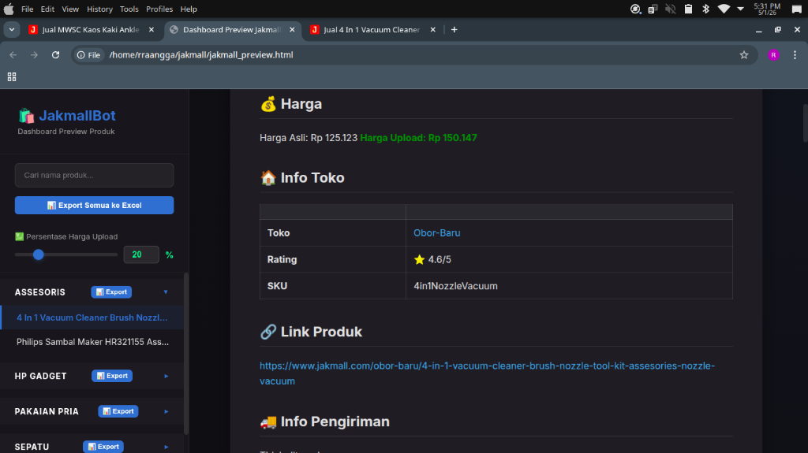

# 🛒 JakmallBot - All-in-One Automation Tools



JakmallBot adalah kumpulan skrip otomasi yang dirancang untuk membantu Anda melakukan *scraping* data produk dari situs web **Jakmall.com**. Bot ini dibangun menggunakan **Python** dan **Playwright** untuk memastikan scraping berjalan lancar, cepat, dan mendukung interaksi halaman yang dinamis (seperti pop-up, scroll, klik, dll).

## 🚀 Fitur Utama

Bot ini menyediakan menu sentral interaktif yang sangat mudah digunakan melalui file `JakmallBot.py`.

1. **[1] Login Jakmall**
   - Membuka browser khusus untuk Anda login ke akun Jakmall secara manual terlebih dahulu. Ini penting agar scraping dapat mengambil data harga asli (terutama bagi member afiliasi/dropshipper).
2. **[2] Scrape Links** (`jakmall_scrape_links.py`)
   - Mengambil (scrape) daftar *link* produk berdasarkan **Kata Kunci (Keyword)** atau **Username Toko**.
   - Dilengkapi berbagai filter:
     - Filter Urutan (Terpopuler, Terbaru, dll)
     - Filter Stok (Tersedia saja)
     - Filter Kategori (Dinamic dari hasil sidebar pencarian Jakmall)
     - Filter Kota Asal Pengiriman
     - Filter Rating Bintang
   - Menyimpan daftar produk ke dalam `jakmall_links.csv`.
3. **[3] Scrape Produk** (`jakmall_scraper.py`)
   - Mengunjungi setiap *link* produk di dalam `jakmall_links.csv` dan mengambil informasi secara mendetail.
   - **Data yang diambil meliputi:**
     - Nama Produk, Harga Asli, dan Harga Upload (Harga Mark-up).
     - SKU (diambil langsung dari DOM HTML).
     - Rating Produk.
     - Variasi / Warna / Ukuran beserta stoknya.
     - Gambar produk (hingga semua gambar yang tersedia).
     - **Pilihan Pengiriman** (JNE, SiCepat, Gosend, dll) yang secara otomatis diambil dengan membuka *modal pop-up* pengiriman.
   - Menyimpan hasilnya di dalam sub-folder `hasil_md/` (format Markdown per produk) dan memperbarui file CSV `jakmall_results.csv`.
4. **[4] Preview Hasil**
   - Men-generate *Dashboard Preview* berbentuk halaman web interaktif (`jakmall_preview.html`).
   - Halaman ini memungkinkan Anda mencari, mem-filter per kategori, dan mengekspor seluruh data yang telah discrape ke format Excel.
   
   
5. **[5] Update Produk**
   - Melakukan pengecekan dan *re-scrape* (memperbarui data) untuk produk-produk yang sudah di-scrape sebelumnya. Sangat berguna untuk sinkronisasi harga & stok terbaru.

---

## 🛠️ Prasyarat (Requirements)

Sebelum menjalankan bot, pastikan sistem Anda memiliki:

*   **Python 3.8+** (Disarankan versi terbaru)
*   **Google Chrome** ter-install di sistem Anda.
*   Library yang dibutuhkan.

## 📦 Cara Instalasi

1. **Clone atau Download** *repository* / folder ini ke komputer Anda.
2. **Buka Terminal / Command Prompt**, arahkan ke folder project (misal: `cd /home/user/jakmall`).
3. **Install Dependencies** yang dibutuhkan menggunakan `requirements.txt`:
   ```bash
   pip install -r requirements.txt
   ```
4. **Install Playwright Browsers**:
   ```bash
   playwright install chromium
   ```

---

## 💻 Cara Penggunaan

Gunakan satu perintah ini untuk mengakses semua fitur bot:

```bash
python JakmallBot.py
```

### Langkah-langkah Penggunaan Ideal:

1. **Login Dulu!**
   Jalankan `python JakmallBot.py`, pilih menu `[1]`. Chrome akan terbuka. Silahkan login ke akun Jakmall Anda. Setelah login, jangan tutup Chrome-nya, kembali ke terminal dan tekan `ENTER`.
2. **Kumpulkan Link Produk**
   Pilih menu `[2]`. Ikuti instruksi di layar (masukkan kata kunci, filter kota, rating, dll). Bot akan menyimpan semua link yang relevan.
3. **Scrape Detail Produk**
   Pilih menu `[3]`. Bot akan membaca kumpulan link tersebut dan mengambil detail gambar, harga, varian, dan kurir pengiriman secara otomatis.
4. **Lihat Hasil**
   Pilih menu `[4]`. Akan terbuat sebuah halaman dashboard `jakmall_preview.html` yang bisa Anda buka di browser. Di sana Anda bisa melihat rangkuman produk dan menekan tombol "Export Semua ke Excel" untuk mendapatkan format akhir.

---

## 📂 Struktur File

- `JakmallBot.py` : Script *launcher* utama (Menu Console).
- `jakmall_scrape_links.py` : Script pengumpul URL produk.
- `jakmall_scraper.py` : Script ekstraksi detail produk.
- `jakmall_links.csv` : Hasil output dari *Scrape Links*.
- `jakmall_results.csv` : Hasil akhir / data terstruktur dari *Scrape Produk*.
- `hasil_md/` : Folder tempat penyimpanan format data mentah (Markdown).
- `jakmall_debug_profile/` : Folder tempat menyimpan sesi (Session/Cookies) Chrome agar tidak perlu login ulang.

## ⚠️ Catatan Penting
*   Bot ini menggunakan mode *Remote Debugging Chrome*. Pastikan Anda tidak membuka Google Chrome secara manual dengan argumen yang bentrok di sistem saat bot berjalan.
*   Kecepatan scraping bergantung pada koneksi internet. Jika halaman terlalu lama di-load, beberapa elemen (seperti pilihan kurir) mungkin gagal terdeteksi (meskipun sudah dilengkapi fitur *auto-retry*).
